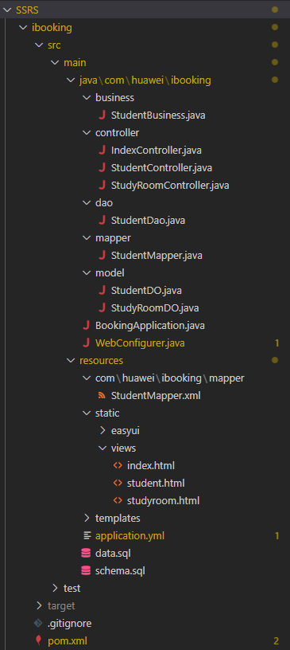

# SSRS
软件过程管理 - 实践项目：自习座位预约系统

ibooking为老师所发参考代码，以下内容为对该代码的分析

文件结构：

|-src

&emsp;&emsp;|-main

&emsp;&emsp;&emsp;&emsp;|-java  // Java主源代码目录

&emsp;&emsp;&emsp;&emsp;&emsp;&emsp;|-com\huawei\ibooking

&emsp;&emsp;&emsp;&emsp;&emsp;&emsp;&emsp;&emsp;|-business  // 具体的业务逻辑代码（接口和实现分离）

&emsp;&emsp;&emsp;&emsp;&emsp;&emsp;&emsp;&emsp;&emsp;&emsp;*|-StudentBusiness.java*

&emsp;&emsp;&emsp;&emsp;&emsp;&emsp;&emsp;&emsp;|-controller  // 控制器代码

&emsp;&emsp;&emsp;&emsp;&emsp;&emsp;&emsp;&emsp;&emsp;&emsp;*|-IndexController.java*

&emsp;&emsp;&emsp;&emsp;&emsp;&emsp;&emsp;&emsp;&emsp;&emsp;*|-StudentController.java*

&emsp;&emsp;&emsp;&emsp;&emsp;&emsp;&emsp;&emsp;&emsp;&emsp;*|-StudyRoomController.java*

&emsp;&emsp;&emsp;&emsp;&emsp;&emsp;&emsp;&emsp;|-dao  // 数据访问层，封装了对数据库的操作

&emsp;&emsp;&emsp;&emsp;&emsp;&emsp;&emsp;&emsp;&emsp;&emsp;*|-StudentDao.java*

&emsp;&emsp;&emsp;&emsp;&emsp;&emsp;&emsp;&emsp;|-mapper  // 数据访问层代码接口

&emsp;&emsp;&emsp;&emsp;&emsp;&emsp;&emsp;&emsp;&emsp;&emsp;*|-StudentMapper.java*

&emsp;&emsp;&emsp;&emsp;&emsp;&emsp;&emsp;&emsp;|-model  // 数据模型代码

&emsp;&emsp;&emsp;&emsp;&emsp;&emsp;&emsp;&emsp;&emsp;&emsp;*|-StudentDO.java*

&emsp;&emsp;&emsp;&emsp;&emsp;&emsp;&emsp;&emsp;&emsp;&emsp;*|-StudyRoomDO.java*

&emsp;&emsp;&emsp;&emsp;&emsp;&emsp;&emsp;&emsp;*|-BookingApplication.java*  // Spring Boot应用程序的入口，项目的启动程序

&emsp;&emsp;&emsp;&emsp;&emsp;&emsp;&emsp;&emsp;*|-WebConfigurer.java*  // Spring Boot配置类 

&emsp;&emsp;&emsp;&emsp;|-resources // 资源文件目录，存放静态配置文件和页面静态资源

&emsp;&emsp;&emsp;&emsp;&emsp;&emsp;|-com\huawei\ibooking\mapper  // XML映射文件

&emsp;&emsp;&emsp;&emsp;&emsp;&emsp;&emsp;&emsp;|-*StudentMapper.xml*

&emsp;&emsp;&emsp;&emsp;&emsp;&emsp;|-static  // 存放网页静态资源

&emsp;&emsp;&emsp;&emsp;&emsp;&emsp;&emsp;&emsp;|-easyui

&emsp;&emsp;&emsp;&emsp;&emsp;&emsp;&emsp;&emsp;|-views  // html页面

&emsp;&emsp;&emsp;&emsp;&emsp;&emsp;&emsp;&emsp;&emsp;&emsp;|-*index.html*

&emsp;&emsp;&emsp;&emsp;&emsp;&emsp;&emsp;&emsp;&emsp;&emsp;|-*student.html*

&emsp;&emsp;&emsp;&emsp;&emsp;&emsp;&emsp;&emsp;&emsp;&emsp;|-*studyroom.html*

&emsp;&emsp;&emsp;&emsp;&emsp;&emsp;|-templates

&emsp;&emsp;&emsp;&emsp;&emsp;&emsp;*|-application.yml*  // 基本配置文件

&emsp;&emsp;&emsp;&emsp;&emsp;&emsp;*|-data.sql*  // 数据文件

&emsp;&emsp;&emsp;&emsp;&emsp;&emsp;*|-schema.sql*

&emsp;&emsp;|-test

&emsp;&emsp;&emsp;&emsp;|-java // 测试主代码目录

&emsp;&emsp;&emsp;&emsp;|-resources // 测试资源文件目录
